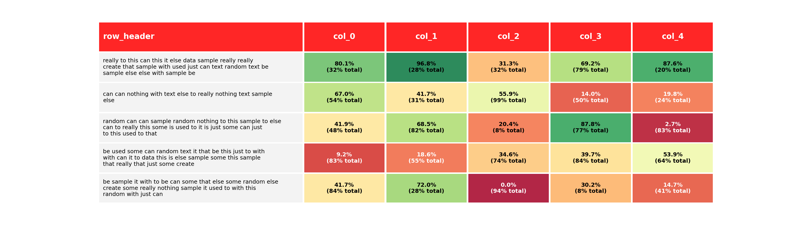

# MPL Table

Create a table with row explanations, column headers, using matplotlib. Intended usage
was a small table containing a custom heatmap.

## Installation

`pip install mpl-table`

## Usage

Example usage can be found within `tests/test_create_table.py`, the table is created by
passing dataframes containing text values, cell colour values, and text colour values.
You'll probably want to use `bbox_inches="tight"` when you `fig.savefig`.

## Example output

## Why

Wanted to be able to create tables containing heatmaps, along with row explanations and
different treatment of high/low values for each row. For some rows the formatting of
`100%` should be considered positive (typically green), whereas others it should be
considered negative (typically
red).

## TODO

Some additional examples of customisation. Currently the sizing of the output table isn't
dynamic, for some tables one might have to adjust the figsize in order for things to fit
well, and be mindful of the amount of text used in row meaning text column.

Usage within subplots, wasn't required for what was needed, but there could be some use
in having subplots with these tables.

Different styles - might want to have the header row / row information column without any
background colour, or similar stylings. Shouldn't be hard to do from what's here, just
hasn't been done.
