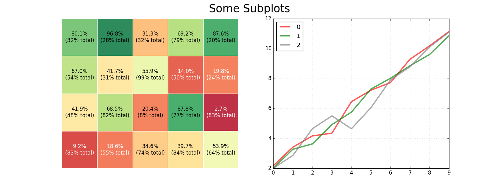
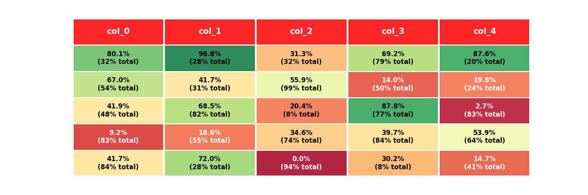

# MPL Table

Create a table with row explanations, column headers, using matplotlib. Intended usage
was a small table containing a custom heatmap.

## Installation

`pip install mpl-table`

## Usage

Example usage can be found within `tests/test_create_table.py`, the table is created by
passing dataframes containing text values, cell colour values, and text colour values.
You'll probably want to use `bbox_inches="tight"` when you `fig.savefig`.

## Example output

Table with row headers:

Table in subplots (without row or column headers):

Table with no row headers:

## Why

Wanted to be able to create tables containing heatmaps, along with row explanations and
different treatment of high/low values for each row. For some rows the formatting of
`100%` should be considered positive (typically green), whereas others it should be
considered negative (typically
red).

## TODO

Simplify creating a table without any row-headers.

Consider makign the spacing for rows/cols dynamic, based on figsize might work.

Different styles - might want to have the header row / row information column without any
background colour, or similar stylings. Shouldn't be hard to do from what's here, just
hasn't been done.
